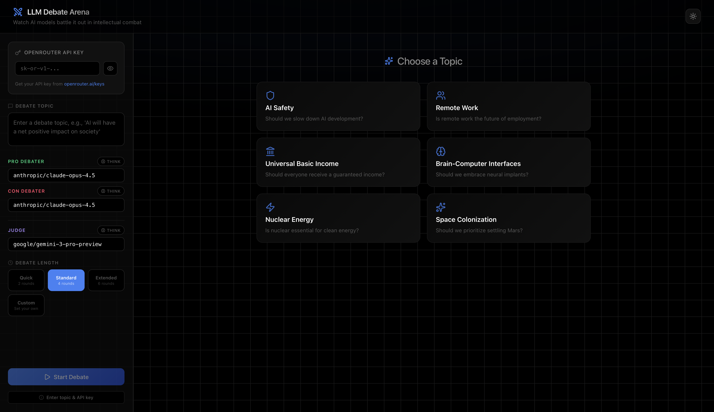

# LLM Debate Arena

LLM Debate Arena is a client-side web app that pits two models against each other in a structured debate, then asks a judge model to score the match.

Public demo: https://llm-debate-arena.netlify.app

## Features
- Head-to-head debates with pro/con debaters and a judge
- Preset lengths plus custom rounds
- Streaming responses with optional reasoning
- Copy the full transcript as Markdown
- Runs fully in the browser; the API key stays in localStorage

## Screenshot


## Getting started
Prereqs: Node.js 18+ and npm.

```bash
npm install
npm run dev
```

Open the local URL printed by Vite, then add your OpenRouter API key when prompted.

## Usage
1. Get an OpenRouter API key from https://openrouter.ai/keys
2. Paste it into the app (stored in localStorage for convenience)
3. Enter a topic, choose models, and start the debate

Model names follow OpenRouter routing names, for example: `anthropic/claude-opus-4.5`.

## Note on prompts
The built-in system prompts are intentionally flamboyant and theatrical to make debates entertaining. They are not meant as serious guidance or best practices for truth-seeking. If you plan to use this for rigorous analysis, rework the system prompts accordingly.

## Scripts
- `npm run dev` - start the dev server
- `npm run build` - build for production
- `npm run preview` - preview the production build
- `npm run lint` - run ESLint

## License
MIT. Credit is appreciated.
